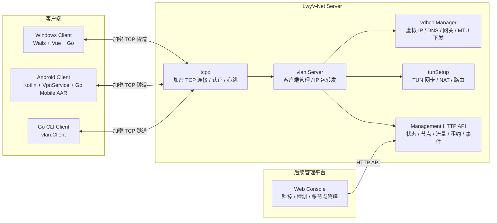
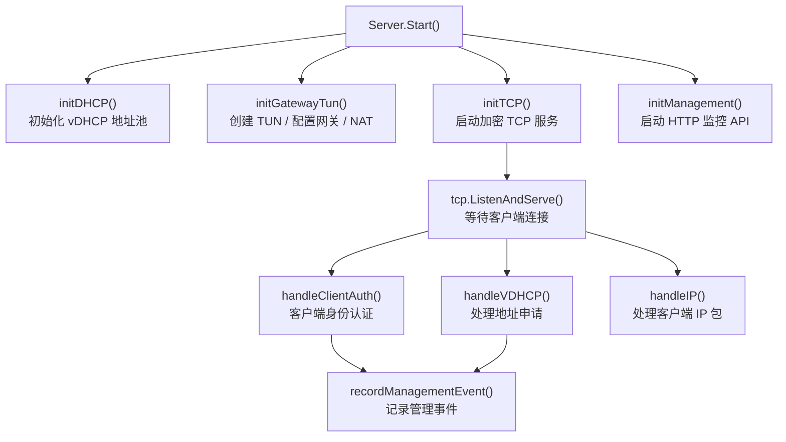
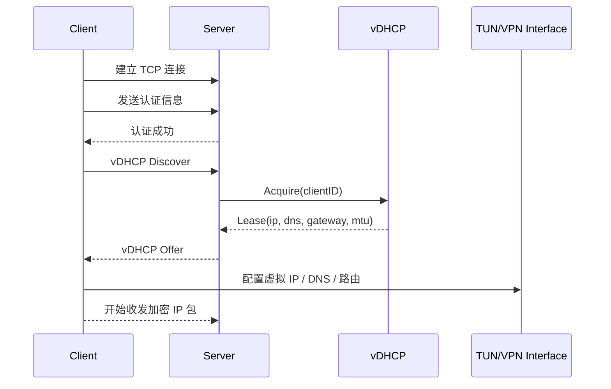
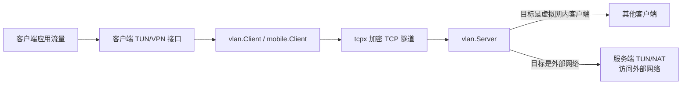
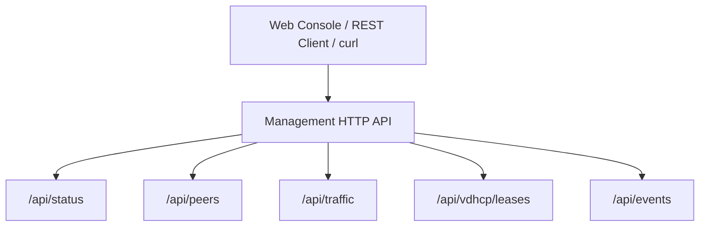
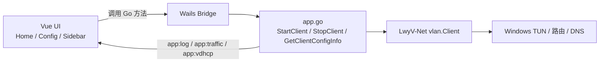
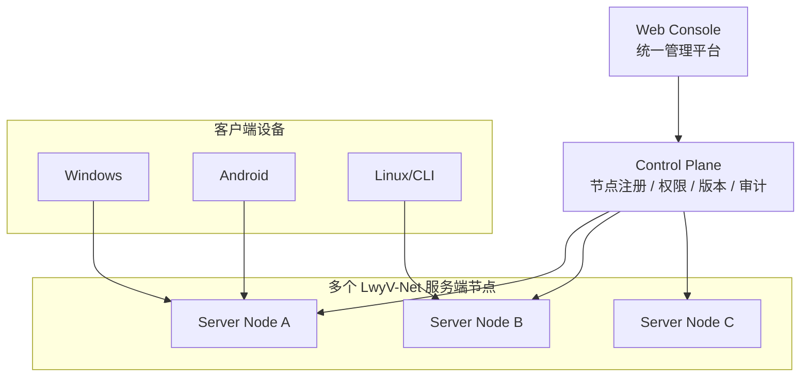

# LwyV-Net 架构说明

本文档用于说明 LwyV-Net 当前的整体架构、核心模块、数据流和后续演进方向。它适合放在项目主页、技术介绍、演示材料或协作者入门文档中。

## 总体架构

LwyV-Net 由服务端、Windows 客户端、Android 客户端和后续 Web 管理平台组成。服务端负责认证、转发、虚拟地址分配和监控 API；客户端负责建立加密隧道、创建虚拟网卡并转发 IP 包。



## 核心模块

```text
config/
  读取和校验 client.json / server.json，填充默认值。

tcpx/
  负责 TCP 连接、密钥认证、加密会话、心跳和重连相关基础能力。

vdhcp/
  负责虚拟 DHCP 报文、地址池、租约、DNS、网关和 MTU 下发。

vlan/
  负责服务端和客户端的核心组网逻辑，包括认证、vDHCP、IP 包转发、流量统计和 management API。

tunSetup/
  负责创建/配置 TUN 网卡、路由、DNS 和服务端 NAT。

mobile/
  面向 Android 的 Go mobile 封装，避免 Android 侧直接依赖桌面 TUN/路由逻辑。
```

## 服务端内部结构

服务端以 `vlan.Server` 为核心对象，负责把 `tcpx`、`vdhcp`、`tunSetup` 和 `management` 串起来。



## 客户端连接流程

客户端启动后会先建立加密 TCP 连接，再进行身份认证，然后通过 vDHCP 获取虚拟网络配置。拿到配置后，客户端创建或配置本地虚拟网卡，并开始转发 IP 包。



## IP 包转发路径

客户端和服务端通过 TUN/VPN 接口收发三层 IP 包，再把 IP 包封装到加密 TCP 隧道中传输。



## vDHCP 下发内容

vDHCP 由服务端统一配置，客户端通过请求自动获取，不需要每个客户端手动配置 IP。

```json
{
  "ip": "172.30.0.10",
  "subnetMask": "255.255.255.0",
  "gateway": "172.30.0.254",
  "dns": ["8.8.8.8", "1.1.1.1"],
  "mtu": 1300,
  "leaseSeconds": 86400
}
```

对应流程：

```text
server.json
  -> config.LoadServerConfig()
  -> vdhcp.ManagerConfig
  -> vdhcp.EncodeOffer()
  -> client.DecodeMessage()
  -> 配置本地 TUN/VPN 接口
  -> UI 回调展示
```

## Management HTTP API

management API 挂在服务端 `vlan.Server` 生命周期里。它默认建议监听 `127.0.0.1`，用于本机或通过 SSH/VSCode 端口转发访问。



当前接口：

```text
GET /api/status         服务端状态、在线数量、vDHCP 配置、总流量
GET /api/peers          在线连接列表、虚拟 IP、远端地址、流量
GET /api/traffic        聚合流量统计
GET /api/vdhcp/leases   vDHCP 租约列表
GET /api/events         服务端事件列表
```

后续可扩展控制接口：

```text
POST /api/peers/{clientID}/disconnect
POST /api/vdhcp/leases/{clientID}/release
POST /api/peers/{clientID}/block
POST /api/peers/{clientID}/unblock
POST /api/vdhcp/sweep
```

## Windows 客户端架构

Windows 客户端使用 Wails 承载 Go 后端和 Vue 前端。



主要展示内容：

- 连接状态。
- 实时上传/下载速率。
- 累计流量。
- vDHCP 下发的 IP、DNS、网关、MTU。
- `client.json` 配置摘要。

## Android 客户端架构

Android 客户端使用 Kotlin UI 和 `VpnService`，底层网络能力来自 Go mobile AAR。

```mermaid
flowchart LR
    Activity["MainActivity<br/>Compose UI"]
    Service["LwyVpnService<br/>前台 VPN 服务"]
    AAR["lwyvnet.aar<br/>mobile.Client"]
    VPN["Android VpnService.Builder<br/>VPN fd"]
    Server["LwyV-Net Server"]

    Activity -->|ACTION_START / ACTION_STOP| Service
    Service --> AAR
    AAR <-->|加密 TCP 隧道| Server
    AAR -->|OnAddress(ip,dns,mtu)| Service
    Service --> VPN
    Service -->|ACTION_STATUS 广播| Activity
```

Android 端的关键点：

- Android 负责申请 VPN 权限。
- `VpnService.Builder` 负责创建系统 VPN 接口。
- Go mobile 客户端负责认证、vDHCP 和 IP 包转发。
- 服务端下发的 DNS 会写入 Android VPN 配置。

## 后续目标架构

未来可以增加 Web 控制台和中心控制面，实现多服务端节点统一管理。



后续核心能力：

- 多节点注册和心跳。
- 统一在线设备列表。
- 跨节点流量与事件监控。
- 控制 API 和权限管理。
- 客户端版本上报和自动更新。
- 审计日志和操作记录。

## 当前架构特点

- 服务端和客户端核心逻辑都在 Go 中，便于复用。
- Windows UI 和 Android UI 只负责展示与平台能力接入。
- vDHCP 让客户端配置更轻，网络参数由服务端统一控制。
- management API 已经具备 Web 平台的数据基础。
- 代码结构适合继续拆分成控制面、数据面和客户端体验三条线。

## 架构演进建议

短期：

- 完善 management API 的安全策略。
- 增加客户端版本上报。
- 增加 Web 管理台 MVP。
- 增加控制 API。

中期：

- 增加自动更新系统。
- 增加节点注册机制。
- 增加 Docker / systemd 部署。
- 增加客户端配置导入导出。

长期：

- 多服务端节点管理。
- 控制面和数据面分离。
- 设备分组、访问策略和权限系统。
- 统一审计、告警和可观测平台。
